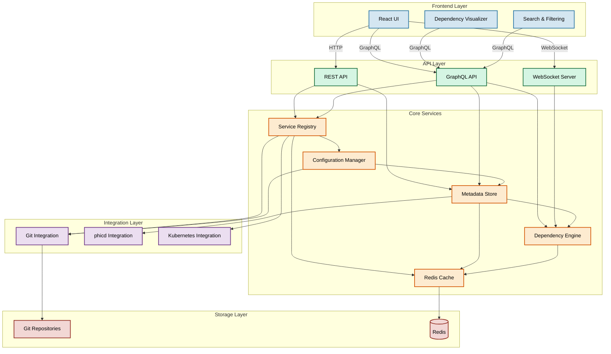

# ADR 0001: Initial Architecture for AureaCore

## Status
Proposed

## Context
AureaCore is being developed as a service catalog component that will integrate with phicd, a cloud-native deployment management system. The service catalog needs to provide comprehensive service discovery, metadata management, and dependency tracking while maintaining compatibility with phicd's architecture and objectives. Following GitOps principles, service definitions will be managed through version control, enabling service owners to maintain their service metadata alongside their code.

## Decision
We will implement AureaCore with the following core architectural components:

### Component Overview

The diagram above illustrates the high-level architecture of AureaCore, showing the main components and their interactions across different layers. Each layer has specific responsibilities and communicates with adjacent layers through well-defined interfaces.

### 1. Core Components

#### Service Registry
- GitOps-based service definition management
  - Root YAML configuration in AureaCore repository
  - Distributed service-specific YAML files in service repositories
  - UI updates only available for services defined in root YAML
- Version history tracking through Git
- Support for both centralized and distributed service registration
- Automated service discovery through Git repository scanning

#### Configuration Management
- Root YAML schema for service discovery and basic metadata
  - Service locations (repository URLs)
  - Reference to service-specific YAML location
  - Optional complete service definitions
- Service-specific YAML schema for detailed metadata
  - Rich service metadata
  - Dependencies and relationships
  - Integration points
  - Deployment configurations
- Schema validation and enforcement
- Git-based change tracking

#### Metadata Store
- Git-backed storage for service definitions
- Cache layer for performance optimization
- Support for custom metadata fields
- Hierarchical service relationships
- Built-in validation framework

#### Dependency Graph Engine
- Real-time dependency visualization
- Impact analysis capabilities
- Circular dependency detection
- Version compatibility checking
- Integration with deployment workflows

### 2. Integration Interfaces

#### Git Integration
- Repository scanning and monitoring
- Webhook-based updates
- Pull request automation for UI-initiated changes
- Branch and environment awareness

#### phicd Integration
- Webhook-based event synchronization
- Shared authentication/authorization
- Deployment state tracking
- Configuration management integration

#### External System Connectors
- Kubernetes service discovery
- CI/CD pipeline integration
- Observability platform integration

### 3. User Interface
- Modern React-based SPA
- Real-time updates via WebSocket
- Interactive dependency visualization
- Advanced search and filtering
- Role-based access control
- GitOps-aware editing capabilities
  - PR creation for root YAML changes
  - Read-only view for distributed service definitions

### 4. API Layer
- GraphQL for flexible data querying
- REST endpoints for simple operations
- WebSocket for real-time updates
- OpenAPI/Swagger documentation
- Rate limiting and caching

## Technical Decisions

1. **GitOps Implementation**
   - Git as the source of truth for service definitions
   - Pull request-based workflow for changes
   - Automated validation and synchronization
   - Clear separation between root and service-specific configurations

2. **Language & Framework**: Rust (see ADR-0002 for detailed rationale)
   - Superior memory safety and concurrency guarantees
   - Excellent performance characteristics
   - Strong type system for complex domain modeling
   - Growing cloud-native ecosystem support
   - Consistency with PhiCD codebase
   - Strong support for async operations
   - Excellent tooling for Git operations and YAML processing

3. **Database**: MongoDB
   - Cache layer for Git-based configurations
   - Flexible schema for service metadata
   - Good support for graph-like queries
   - Scalable for large service catalogs
   - Strong Rust driver support (mongodb-rust-driver)

4. **API Design**: GraphQL + REST hybrid
   - GraphQL for complex queries and real-time subscriptions
   - REST for simple CRUD operations
   - WebSocket for live updates

5. **Frontend**: React + TypeScript
   - Consistent with phicd's UI choices
   - Strong component ecosystem
   - Built-in TypeScript support

6. **Deployment**: Kubernetes-native
   - Containerized microservices
   - Helm charts for deployment
   - Horizontal scaling capability
   - Cloud-native best practices

## Consequences

### Positive
- GitOps approach provides clear audit trail and version control
- Service owners maintain control over their service definitions
- Flexible deployment options (centralized or distributed)
- Strong typing reduces runtime errors
- Integration-first design simplifies phicd compatibility

### Negative
- Multiple configuration sources require careful synchronization
- Distributed YAML files may become out of sync
- Need to handle Git operation failures gracefully
- Steeper learning curve for contributors (mitigated by AI assistance)

### Risks
- Service-specific YAML files might drift from schema
- Performance impact of Git operations at scale
- Need to handle repository access control carefully
- Integration points with phicd need careful coordination

## Implementation Strategy

1. Phase 1: Core GitOps Infrastructure
   - Root YAML schema definition
   - Service-specific YAML schema definition
   - Git integration and synchronization
   - Basic UI for viewing services

2. Phase 2: Service Management
   - UI-based service creation (root YAML only)
   - Pull request automation
   - Validation framework
   - Cache layer implementation

3. Phase 3: Dependency Management
   - Dependency graph implementation
   - Visualization components
   - Impact analysis features
   - Cross-repository dependency tracking

4. Phase 4: Integration Layer
   - phicd integration
   - External system connectors
   - Real-time updates

5. Phase 5: Advanced Features
   - Custom metadata fields
   - Advanced search
   - Batch operations
   - Analytics and reporting

## References
- [phicd System Overview](https://github.com/spiralhouse/phicd/blob/main/docs/architecture/system-overview.md)
- [phicd Objectives](https://github.com/spiralhouse/phicd/blob/main/docs/objectives.md)
- [Cloud Native Best Practices](https://github.com/cncf/tag-app-delivery/blob/main/README.md)
- [GitOps Principles and Practices](https://opengitops.dev/) 