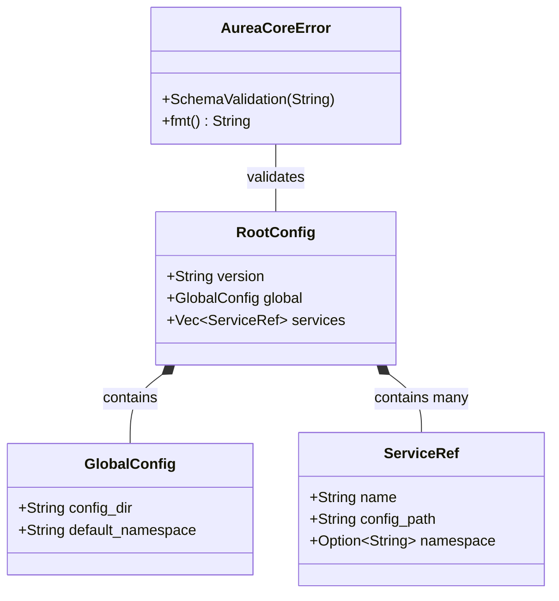

# Schema Module Design

The schema module is responsible for defining and validating the configuration structures used throughout AureaCore. It provides type-safe representations of configuration data and ensures that all configurations adhere to their defined schemas.

## Class Diagram



## Component Descriptions

### RootConfig
The root configuration structure that represents the top-level configuration for AureaCore. It contains:
- `version`: Schema version identifier for compatibility checking
- `global`: Global settings that apply across all services
- `services`: List of service references managed by AureaCore

### GlobalConfig
Contains global settings that apply to all services in the system:
- `config_dir`: Base directory where service configurations are stored
- `default_namespace`: Default namespace for services that don't specify one

### ServiceRef
References a service configuration file and provides basic service metadata:
- `name`: Unique identifier for the service
- `config_path`: Path to the service's configuration file (relative to config_dir)
- `namespace`: Optional namespace override for the service

### AureaCoreError
Error type for handling validation and other errors in AureaCore:
- `SchemaValidation`: Represents schema validation errors with a descriptive message
- Additional error types will be added as more features are implemented

## Validation Flow

1. Configuration files are loaded as YAML
2. YAML is deserialized into the appropriate struct (RootConfig, etc.)
3. Schema validation is performed using schemars and jsonschema
4. Any validation errors are converted to AureaCoreError::SchemaValidation

## Usage Example

```rust
use aureacore::schema::{RootConfig, GlobalConfig, ServiceRef};
use serde_yaml;

// Load and validate configuration
let config_str = r#"
version: "1.0"
global:
  config_dir: "/etc/aureacore/configs"
  default_namespace: "default"
services:
  - name: "auth-service"
    config_path: "auth/config.yaml"
    namespace: "auth"
"#;

// Deserialize and validate
let config: RootConfig = serde_yaml::from_str(config_str)?;

// Access configuration
println!("Config version: {}", config.version);
println!("Default namespace: {}", config.global.default_namespace);
```

## Future Enhancements

1. **Service Schema**: Implementation of service-specific schema validation
2. **Schema Versioning**: Version migration support for configuration updates
3. **Custom Validators**: Additional validation rules beyond JSON Schema
4. **Caching**: Schema compilation caching for improved performance

## Testing Strategy

The module follows a Test-Driven Development (TDD) approach with:

1. **Unit Tests**: For individual struct validation
2. **Integration Tests**: For complete configuration validation
3. **Edge Cases**: Tests for schema versioning and error conditions
4. **Performance Tests**: For schema validation with large configurations

Tests are located alongside the code they test, following Rust's module system conventions. 