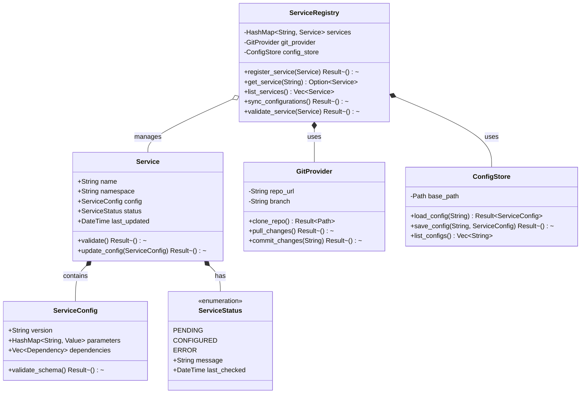
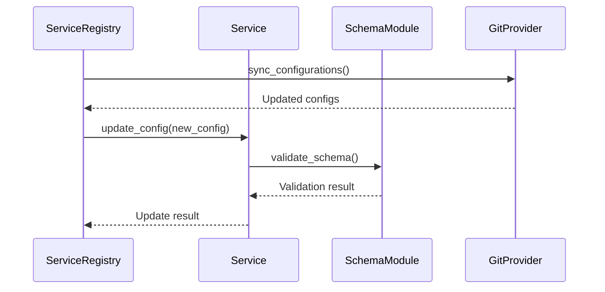

# Service Registry Design

The Service Registry is a core component of AureaCore that manages service definitions, their configurations, and their lifecycle. It acts as the source of truth for service information and provides interfaces for service discovery, configuration management, and state tracking.

## Class Diagram



## Component Interactions

### Service Registry with Schema Module
- Uses the schema module to validate service configurations
- Ensures all service configurations comply with their defined schemas
- Handles schema version compatibility during updates



## Component Descriptions

### ServiceRegistry
The central component that manages all services and their configurations:
- Maintains an in-memory registry of all services
- Coordinates with Git for configuration synchronization
- Ensures configuration validity through schema validation
- Provides service discovery and status tracking

### Service
Represents an individual service in the system:
- Contains service metadata and current configuration
- Tracks service status and configuration validity
- Handles service-specific validation rules
- Manages service configuration updates

### ServiceConfig
Holds the configuration data for a service:
- Stores service-specific parameters and settings
- Manages dependencies between services
- Validates against service-specific schemas
- Supports version tracking for configuration changes

### ServiceStatus
Tracks the current state of a service:
- PENDING: Initial state or during configuration updates
- CONFIGURED: Successfully configured and validated
- ERROR: Configuration or validation errors detected

### GitProvider
Handles Git operations for configuration management:
- Clones and updates configuration repositories
- Manages branches for different environments
- Handles commit and push operations for config changes
- Provides atomic operations for configuration updates

### ConfigStore
Manages the local storage of service configurations:
- Handles reading and writing of configuration files
- Maintains file system structure for configurations
- Provides caching and optimization for config access
- Ensures atomic file operations for configuration updates

## Validation and Update Flow

1. **Configuration Update**
   ```mermaid
   flowchart TD
       A[Git Change] -->|Trigger| B[Sync Configurations]
       B --> C{Changes Detected?}
       C -->|Yes| D[Load New Configs]
       D --> E[Validate Schemas]
       E --> F{Valid?}
       F -->|Yes| G[Update Services]
       F -->|No| H[Mark Error Status]
       G --> I[Commit Status]
       H --> I
   ```

2. **Service Registration**
   ```mermaid
   flowchart TD
       A[New Service] -->|Register| B[Validate Config]
       B --> C{Valid?}
       C -->|Yes| D[Add to Registry]
       C -->|No| E[Reject Registration]
       D --> F[Initialize Status]
       F --> G[Notify Subscribers]
   ```

## Future Enhancements

1. **Event System**
   - Publish configuration changes
   - Subscribe to service status updates
   - Webhook notifications for state changes

2. **Dependency Management**
   - Track service dependencies
   - Validate dependency graphs
   - Handle circular dependencies

3. **Configuration Versioning**
   - Track configuration history
   - Support rollbacks
   - Version diffing and comparison

4. **Health Checks**
   - Active service monitoring
   - Automatic status updates
   - Health metrics collection

## Testing Strategy

1. **Unit Tests**
   - Service registration and validation
   - Configuration parsing and updates
   - Status management

2. **Integration Tests**
   - Git synchronization
   - Configuration store operations
   - End-to-end service updates

3. **Performance Tests**
   - Large-scale service registration
   - Bulk configuration updates
   - Concurrent operations

4. **Failure Tests**
   - Network issues with Git
   - Invalid configurations
   - Partial updates 